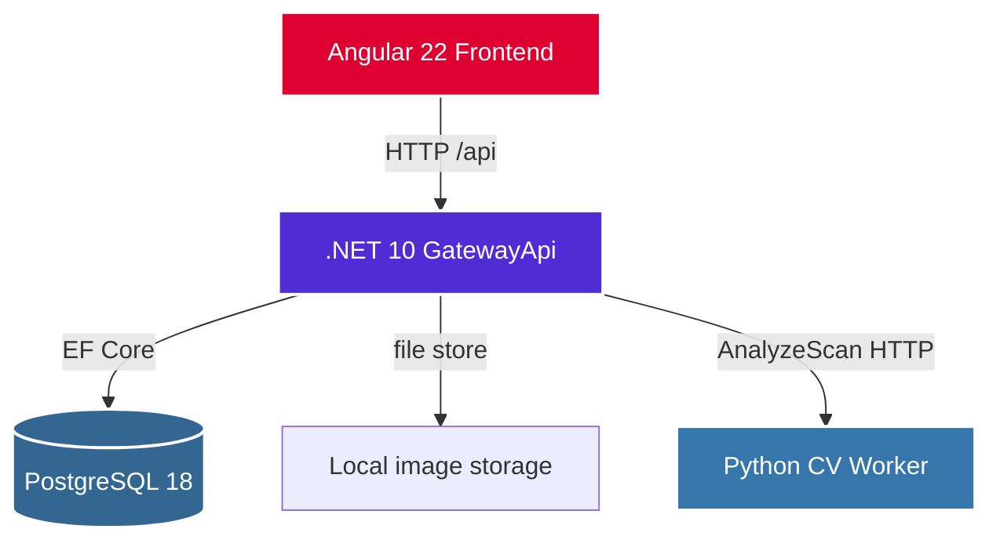

# PearlMetric

Local MVP for teeth-whitening shade tracking: capture scan frames, run color analysis, and track DeltaE progress over a regimen.

## Architecture

Angular calls the ASP.NET gateway directly. The Python CV worker is isolated behind an HTTP contract; local development currently uses an in-process fake analyzer.



| Piece | Role today |
|---|---|
| **GatewayApi** | Minimal APIs, validation, EF persistence, frame storage, analysis orchestration |
| **PostgreSQL 18** | Patients, regimens, runs, frames, calibration, color samples |
| **Local image store** | Frame bytes under `src/GatewayApi/frame-data/` (gitignored) |
| **Fake CV client** | Deterministic Lab/DeltaE stand-in until the Python worker lands |
| **Angular frontend** | Not scaffolded yet (`src/Frontend/` reserved) |

## Repository layout

```
pearl-metric
├── .env.example
├── docker-compose.yml
├── global.json              # .NET SDK pin
├── .nvmrc                   # Node 24 pin (Angular later)
├── PearlMetric.slnx
├── PLAN.md
├── scripts/build.sh
├── scripts/test.sh
└── src/GatewayApi
    ├── Configuration/       # Options (CV worker, image storage)
    ├── Contracts/Api/       # Frontend HTTP DTOs
    ├── Contracts/CvWorker/  # Gateway ↔ CV wire format
    ├── Data/                # EF DbContext
    ├── Domain/              # Status transition rules
    ├── Endpoints/           # Minimal API routes
    ├── Models/              # EF entities
    ├── Services/            # Application logic (+ fake CV)
    ├── Storage/             # Local file image store + validation
    └── Validation/          # Request → Problem Details
```

## Prerequisites

- Docker & Docker Compose
- .NET 10 SDK (see `global.json`)
- Node.js 24 (see `.nvmrc`; needed later for Angular)

## Getting started

### 1. Postgres

```bash
cp .env.example .env
# set POSTGRES_PASSWORD in .env
docker compose up -d
```

### 2. Connection string

Password must match `.env`:

```bash
cd src/GatewayApi
dotnet user-secrets set ConnectionStrings:PearlMetric \
  'Host=localhost;Port=5432;Database=pearlmetric_dev;Username=pearladmin;Password=YOUR_PASSWORD'
```

Or set `ConnectionStrings__PearlMetric` in the environment.

### 3. Build and run

```bash
# from repo root
./scripts/build.sh
./scripts/test.sh

cd src/GatewayApi
dotnet watch run
```

Note the HTTP URL in the console (often `http://localhost:5039`).

### 4. API docs (Development)

With the API running in Development:

- **Scalar UI:** `http://localhost:<port>/scalar`
- **OpenAPI JSON:** `http://localhost:<port>/openapi/v1.json`

Scalar lists public endpoints with summaries/descriptions. Path IDs (`patientId`, `regimenId`, `runId`) are real GUIDs from create responses in your local database — paste those when trying requests.

## Typical clinic flow

1. `POST /api/patients` — create patient  
2. `POST /api/regimens` — start whitening regimen  
3. `POST /api/runs` — open a Pending scan run  
4. `POST /api/runs/{runId}/frames` — multipart upload; form field `files` (JPEG/PNG)  
5. `POST /api/runs/{runId}/analyze` — Pending → Processing → Completed/Failed (fake CV locally)  
6. `GET /api/runs/{runId}/analysis` — calibration + Lab/DeltaE samples  

DeltaE is measured against the **first completed scan** in the same regimen when one exists. Re-analyzing a Completed run is idempotent.

### Useful extras

| Endpoint | Notes |
|---|---|
| `GET /health` | Liveness |
| `GET /api/runs/{runId}` | Status + frame/sample counts |
| `GET /internal/frames/{runId}/{sequenceIndex}` | Frame bytes for the CV worker (excluded from Scalar) |
| `GET /api/analytics/regimens/{id}/progress` | Placeholder (`501`) until analytics ships |

## Frame upload tip

Use multipart form-data with key **`files`** (type File). Do not set `Content-Type` manually in Postman/Scalar beyond what the client sets for multipart.

## Configuration

| Setting | Purpose |
|---|---|
| `ConnectionStrings:PearlMetric` | Postgres (user secrets or env) |
| `CvWorker:BaseUrl` / `TimeoutSeconds` | Future Python worker URL |
| `ImageStorage:*` | Local root path, size/dimension limits, max frames per run |

See `src/GatewayApi/appsettings.json` and `.env.example`.

## Notes

- Do not commit `.env` or real passwords.
- Wiping the Docker Postgres volume clears patients/runs; restarting the API alone does not.
- Uploading more frames to the same run appends sequence indexes (`0`, `1`, …).
