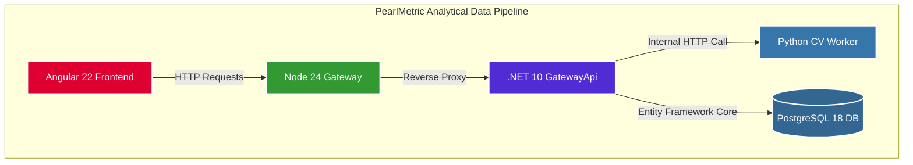

```mermaid
    graph LR
        subgraph Infra [Backend Infrastructure]
            App[.NET API AppPool]
            Scheduler{Quartz.NET Engine}
            DB[(PostgreSQL 18 Ledger)]
            Notify[Notification Worker]
        end

        App -->|Schema Updates| DB
        Scheduler -->|Persistent State| DB
        Scheduler -->|Trigger Job| Notify
        
        style App fill:#512bd4,stroke:#fff,stroke-width:2px,color:#fff
        style Scheduler fill:#61dafb,stroke:#333,stroke-width:2px,color:#333
        style DB fill:#336791,stroke:#fff,stroke-width:2px,color:#fff
        style Notify fill:#ff9900,stroke:#fff,stroke-width:2px,color:#fff
````